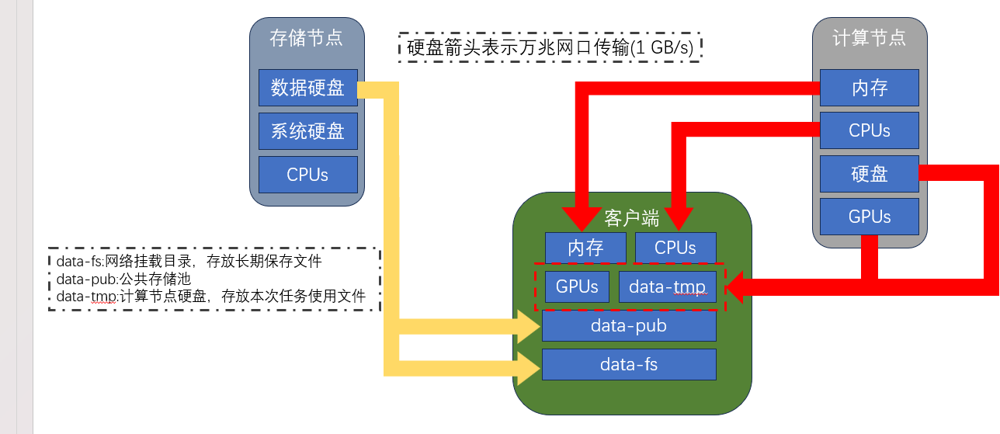

# 服务器配置以及使用说明
## 写在前面
- <font size=4 color=pink>计算节点配置为:</font>
    - <font size=4 color=pink>4 * NVIDIA GeForce RTX 3090</font>
    - <font size=4 color=pink>1 * NVIDIA GeForce RTX 4090</font>
- <font size=4 color=pink>存储节点配置为:</font>
    - <font size=4 color=pink>N * 4T机械硬盘</font>

## 目录
- <font size=4>[计算节点配置]()</font>
- <font size=4>[存储节点配置]()</font>
- <font size=4>[集群规划]()</font>
- <font size=4>[使用说明]()</font>
- <font size=4>[附录]()</font>

##  一、计算节点配置
### 目前共享集群部分包括：2个计算节点，1个存储节点，1个管理节点
```
3090 计算节点

    CPU: 2 * Intel(R) Xeon(R) Silver 4210R CPU @ 2.40GHz
    内存: 256G DDR4 RECC 2933
    硬盘: 1 * Intel P4510 4T U.2
    GPU: 4 * NVIDIA GeForce RTX 3090
    网卡: 万兆网卡
    电源: 2000W(1+1)
    机架类型: 4U工作站
    操作系统: Ubuntu22.04 Server
```

```
4090 计算节点

    CPU: 2 * Intel(R) Xeon(R) Golden 6133 CPU @ 2.50GHz
    内存: 256G DDR4 RECC 2666
    硬盘: 1 * Acer N7000 4T M.2
    GPU: 1 * NVIDIA GeForce RTX 4090
    网卡: 万兆网卡
    电源: 2000W(1+1)
    机架类型: 4U机架式
    操作系统: Ubuntu22.04 Server
```

##  二、存储节点配置
### 目前共享集群部分包括：2个计算节点，1个存储节点，1个管理节点
```
    CPU: Intel(R) Xeon(R) CPU E5-2658 v4 @ 2.30GHz
    内存: 256G DDR4 RECC 2666
    系统硬盘: 240G SSD
    数据硬盘: 2T SAS机械盘*6(Raid 5) 共 10 TB
    网卡: 万兆网卡
    电源: 2000W(1+1)
    机架类型: 2U机架式
    操作系统: Ubuntu22.04 Server
```

##  三、集群规划
### 1. 集群规划图
<p align = "center">    

</p>
### 说明: 
- <font size=4>镜像相关：</font>
    - <font size=3>因为可正常使用的镜像需要一定的配置支持（Jupyter, SSH, et.al.），所以原有的镜像暂时还不支持无缝使用，需要等待后续更新。</font>
    - <font size=3>集群中默认涵盖了大部分常用的镜像（与autodl保持一致），使用集群时直接使用即可。</font>
    - <font size=3>目前提供了社区镜像选项，**请自行判断安全性**。</font>
    - <font size=3>镜像保存目前还不支持保存在镜像仓库，仅可保存于宿主机（即：A卡实例镜像只可保存于A卡所在宿主机）</font>

- <font size=4>磁盘相关：</font>  
    - <font size=3>每个实例的目录如下：</font>
    ```
          / --- |
                | --- autodl-tmp
                | --- data_public
                | --- data_user
                | --- miniconda3
                | --- tf-logs
    ```
    - <font size=3> <font size=4 color=#737300 face="华文琥珀">autodl-temp:</font> 集群中每个计算节点提供了<font size=3 color=red>总空间</font>为 4T 的高速磁盘，命名为 autodl-temp。该部分空间用于存放实例，并且只允许**存放临时数据**，实例释放时该部分内容全部删除。</font>
    
    - <font size=3> <font size=4 color=#737300 face="华文琥珀">data_public:</font> 公共的长期保存数据存放于网络挂载的磁盘阵列（Raid 5），通过万兆网进行数据交换，命名为data_public。</font>

    - <font size=3> <font size=4 color=#737300 face="华文琥珀">data_user:</font> 所有的数据（代码/数据集）存放于网络挂载的磁盘阵列（Raid 5），通过万兆网进行数据交换，命名为data_user，目前未进行用户处理。</font>

    - <font size=3> <font size=4 color=#737300 face="华文琥珀">miniconda3:</font> anaconda3/miniconda3 安装目录。</font>

    - <font size=3> <font size=4 color=#737300 face="华文琥珀">tf-logs:</font> 日志保存目录，位于实例内部。</font>

- <font size=4>使用相关：</font>
    - <font size=3>单个用户允许创建的最多容器数量为 4 </font>
    - <font size=3>GPU低占用率持续时间超过60分钟自动关机</font>
    - <font size=3>单个用户最多占用GPU数量为 2 </font>
    - <font size=3>无卡模式配置为 1 线程，2 GiB内存</font>
## 四、使用说明
### 1. [创建autodl账户](https://www.autodl.com/login)
### 2. 加入私有云。填写过群中的在线表格 服务器账户名单 即可。
### 3. [登录私有云](https://private.autodl.com/login)
### 4. 创建实例
<p align = "center"></p>
<p align = "center"></p>
<p align = "center"></p>
<p align = "center"></p>

### 5. 使用实例
<p align = "center"></p>

### 使用JupyterLab / VsCode 等编辑器即可。
### 6. 保存镜像
<p align = "center">  </p>

## 附录