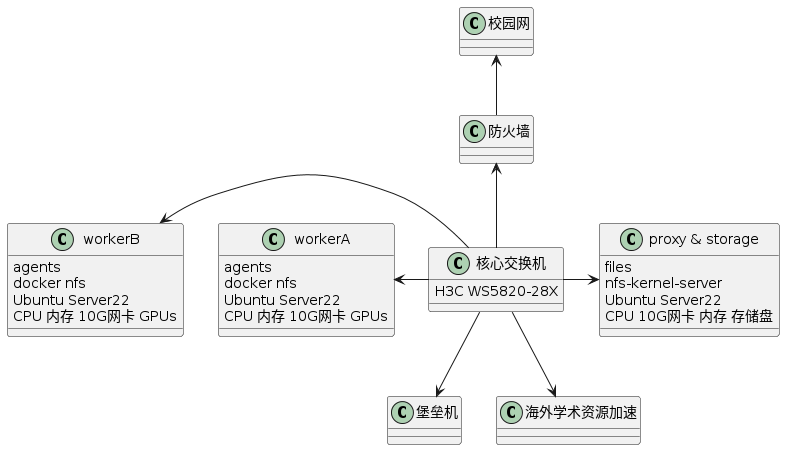
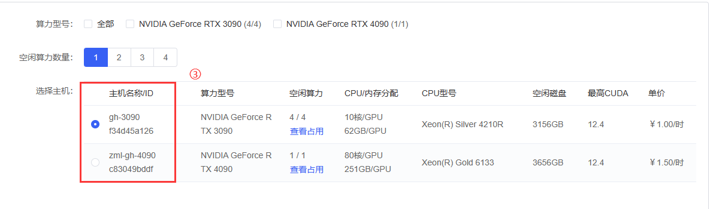
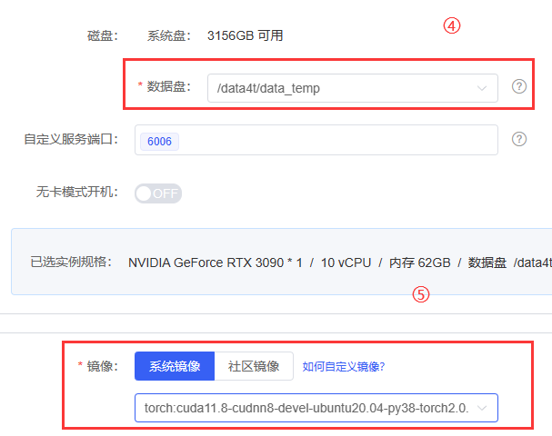

# 服务器配置以及使用说明

## 写在前面

- 计算节点配置为:
  - 4 * NVIDIA GeForce RTX 3090
  - 1 * NVIDIA GeForce RTX 4090
- 存储节点配置为:
  - 2T SAS机械硬盘&6 Raid5阵列

## 目录

- [计算节点配置](#一计算节点配置)
- [存储节点配置](#二存储节点配置)
- [集群规划](#三集群规划)
- [使用说明](#四使用说明)
- [附录](#附录)

## 一、计算节点配置

**目前共享集群部分包括：2个计算节点，1个存储+管理节点，以及防火墙堡垒机和学术资源加速服务器等资源，以下是关于2个计算节点的配置情况说明**

**3090 计算节点**

- CPU: 2 * Intel(R) Xeon(R) Silver 4210R CPU @ 2.40GHz
- 内存: 256G DDR4 RECC 2933
- 硬盘: 1 * Intel P4510 4T U.2
- GPU: 4 * NVIDIA GeForce RTX 3090
- 网卡: 英特尔82599ES 万兆网卡
- 电源: 2000W(1+1)
- 机架类型: 4U工作站
- 操作系统: Ubuntu22.04 Server

**4090 计算节点**

- CPU: 2 * Intel(R) Xeon(R) Golden 6133 CPU @ 2.50GHz
- 内存: 256G DDR4 RECC 2666
- 硬盘: 1 * Acer N7000 4T M.2
- GPU: 1 * NVIDIA GeForce RTX 4090
- 网卡: 英特尔82599ES 万兆网卡
- 电源: 2000W(1+1)
- 机架类型: 4U机架式
- 操作系统: Ubuntu22.04 Server

## 二、存储+管理节点配置

**目前共享集群部分包括：2个计算节点，1个存储+管理节点，以及防火墙堡垒机和学术资源加速服务器等资源，以下是关于存储+管理节点的配置情况说明**

- CPU: Intel(R) Xeon(R) CPU E5-2658 v4 @ 2.30GHz
- 内存: 32G DDR4 RECC 2133
- 系统硬盘: 240G SSD
- 数据硬盘: 2T SAS机械盘*6(Raid 5) 共 10 TB
- 网卡: 英特尔82599ES 万兆网卡
- 电源: 750W(1+1)
- 机架类型: 2U机架式
- 操作系统: Ubuntu22.04 Server

## 三、集群规划

### 1. 集群规划图

### 说明: 

- 镜像相关：

  - 因为可正常使用的镜像需要一定的配置支持（Jupyter, SSH, et.al.），所以原有的镜像暂时还不支持无缝使用，需要等待后续更新。
  - 集群中默认涵盖了大部分常用的镜像（与autodl基本保持一致），使用集群时直接使用即可。
  - 目前提供了社区镜像选项，用户可以使用自定义镜像（例如*CodeWithGPU*中的镜像），**请自行判断安全性**。
  - 镜像保存目前还不支持保存在镜像仓库，仅可保存于宿主机（即：A卡实例镜像只可保存于A卡所在宿主机），但可以支持不同宿主机之间的实例迁移。

- 磁盘相关：

  - 每个实例的/root目录如下：

        / --- |
              | --- autodl-tmp
              | --- data_public
              | --- data_user
              | --- miniconda3
              | --- tf-logs

  - **autodl-temp:** 集群中每个计算节点提供了总空间为 4T 的高速磁盘，命名为 autodl-temp。该部分空间用于存放实例，并且只允许存放临时数据，实例释放时该部分内容全部删除,请务必不要在此处存放重要数据，较大数据集.

  - **data_public:** 公共的长期保存数据存放于网络挂载的磁盘阵列（具备较高数据可靠性的Raid 5阵列），通过万兆网进行数据交换，命名为data_public.

  - **data_user:** 所有的数据（代码/数据集）存放于网络挂载的磁盘阵列（具备较高数据可靠性的Raid 5阵列），通过万兆网进行数据交换，命名为data_user，目前未进行用户处理.

  - **miniconda3:** anaconda3/miniconda3 安装目录.

  - **tf-logs:** 日志保存目录，位于实例内部，可以使用实例监控中的tensorboard读取该目录的日志.

- 使用相关：

  - 单个用户允许创建的最多容器数量为 3 
  - GPU低占用率持续时间超过120分钟自动关机
  - 单个用户最多占用GPU数量为 1 
  - 进行数据传输时请选择无卡模式开机以避免资源浪费，无卡模式配置为 1 线程，2 GiB内存

## 四、使用说明

### 写在前面：因为docker国区被禁以及网络问题，先将我环境创建以及实例运行中的问题列出如下跟大家分享，如果遇到相同问题可查看对应解决办法
- 在使用conda创建新环境或者使用conda安装依赖时出现了`HTTPS 000`或者`HTTP 000`的连接错误。可以使用[学术资源加速](../Proxy.md)进行加速，但请使用完成后及时关闭，随用随关。Github, HuggingFace使用同理。
- 如果你直接使用conda进行依赖的安装并未出现报错信息并且速度仍可接受，就请不要在使用资源加速了。因为测试时间为 2024-06-16 ，学校正在进行综合评定，我们不确定是否为信号干扰导致网络不稳定。
- 使用conda进行下载时（尤其是较大的依赖包）出现了字符长度不匹配的报错，类似于`condaerror: downloaded bytes did not match content-length`，这是因为下载速度慢导致超时使得预期大小和实际大小不一致，请使用如下代码修改超时判断条件。`conda config --set remote_read_timeout_secs 6000.0`
- 请不要更换镜像源，因为国内的镜像源最近都不太稳定，直接走学术资源加速即可（随用随关），我在使用tuna镜像进行pip和conda安装时均出现了错误。
### 1. [创建autodl账户](https://www.autodl.com/login)，并保存相应的id号.

### 2. 加入私有云。填写过群中的在线表格 服务器账户名单 即可.

### 3. [登录私有云](https://private.autodl.com/login)

### 4. 创建实例

### 5. 使用实例

### 使用JupyterLab / VsCode 等编辑器即可.

### 本指导基于autodl私有云完成，详情请参考[官方文档](https://private.autodl.com/docs/)

## 附录

This is an LTS program, with additional features to be uploaded later, so please feel free to raise issues and submit pull requests without hesitation.
